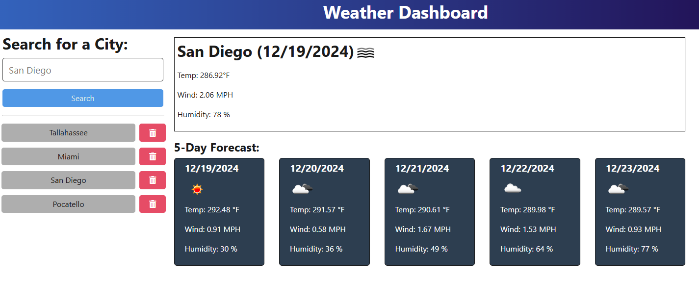

# WeatherDashboard

A webpage for viewing current and future weather conditions for a specified city.

## Table of Contents

- [Usage](#usage)
- [Testing](#testing)
- [License](#license)
- [Questions](#questions)

## Usage

The site is hosted via [Render](https://render.com/) at the following link: https://weatherdashboard-il8d.onrender.com/

After entering a city name, the website displays the current weather conditions and a 5-day forecast. Cities recently searched are stored in the history and can be easily accessed by clicking on them again. You can remove cities from the history with the delete button.

## Testing

To install locally, after cloning run `npm ci` at the command prompt.

After installation, the page can be run locally using `npm run start-dev` to spin up the server and client for testing purposes.

## License

This project is governed by The MIT License. For more information, click or tap on the badge below.

## Questions

I can be reached with questions at https://www.github.com/Prelle or via email at p.elayne.terry@gmail.com.